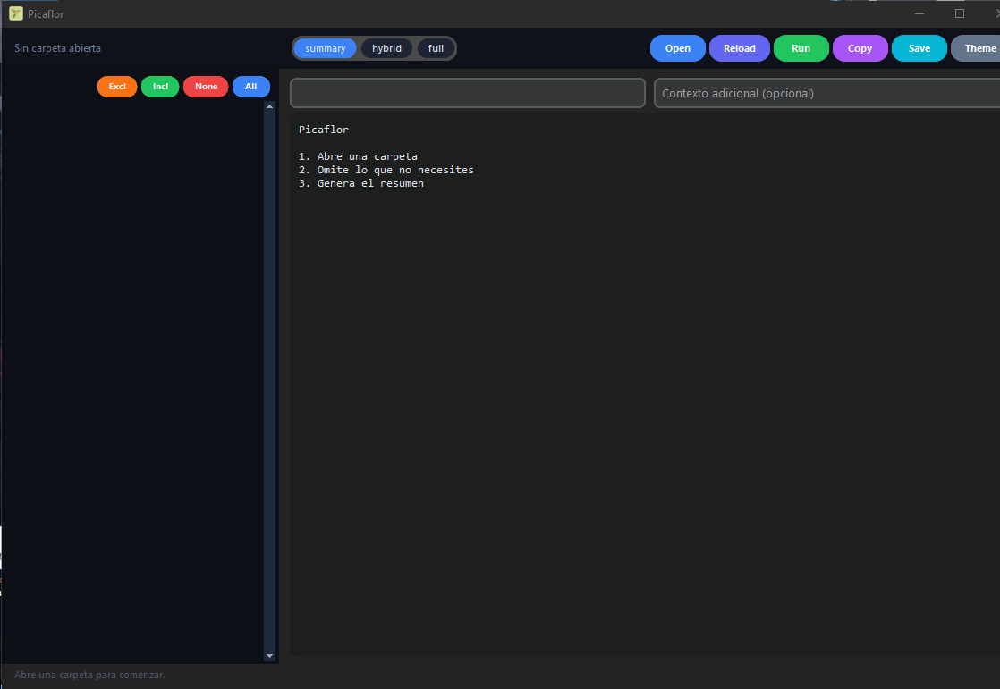

# 🐦 Picaflor


**Picaflor** es una herramienta de escritorio en Python para analizar proyectos de código, detectar tecnologías, resumir archivos y generar un contexto listo para pegar en chats con IA. En lugar de pasar 60 archivos uno por uno, Picaflor genera un solo texto estructurado que cualquier modelo de lenguaje puede entender de inmediato.

---

## 📸 Vista Previa

<p align="center">
  
</p>

---

## ✨ Características Principales

- **Apertura de carpeta** → Selecciona la raíz de cualquier proyecto
- **Árbol visual** → Navega la estructura con colores por estado
- **Inclusión/exclusión** → Doble clic o botones para marcar qué archivos analizar
- **Detección automática** → Tecnologías, dependencias, scripts desde `package.json`, `requirements.txt`, `pyproject.toml`, `tsconfig.json`, `vite.config.*`
- **3 modos de resumen:**
  - `summary` → Estructura, tecnologías y propósito por archivo
  - `hybrid` → Igual que summary + código de archivos clave
  - `full` → Todo el código de todos los archivos incluidos
- **Editor de salida** → Edita el resumen antes de copiarlo
- **Copiar y guardar** → Portapapeles o archivo `.md`
- **Contexto adicional** → Campo para agregar objetivo o instrucciones extra
- **Nombre del proyecto** → Se incluye en el encabezado del resumen
- **Tema claro / oscuro**
- **Atajos de teclado** → `Ctrl+O`, `Ctrl+R`, `Ctrl+G`, `Ctrl+S`

---

## 🛠️ Stack Tecnológico

| Capa | Tecnología |
|------|-----------|
| GUI | CustomTkinter |
| Árbol | ttk.Treeview |
| Portapapeles | pyperclip |
| Gitignore | pathspec |
| TOML | tomli / tomllib |
| Imágenes | Pillow |

---

## 🚀 Instalación y uso

**1. Instalar dependencias:**
```bash
pip install -r requirements.txt
```

**2. Ejecutar:**
```bash
python app.py
```

---

## 🔄 Flujo de trabajo

```
1. Abre Picaflor
2. Pulsa Open → selecciona la carpeta del proyecto
3. Revisa el árbol → excluye lo que no necesitas (doble clic o botón ✕)
4. Escribe el nombre del proyecto y contexto adicional si quieres
5. Elige el modo: summary, hybrid o full
6. Pulsa Run → espera el resumen
7. Edita si necesitas ajustes
8. Pulsa Copy → pega el resultado directo en el chat con la IA
```

---

## ⌨️ Atajos de Teclado

| Atajo | Acción |
|-------|--------|
| `Ctrl+O` | Abrir carpeta |
| `Ctrl+R` | Releer carpeta |
| `Ctrl+G` | Generar resumen |
| `Ctrl+S` | Guardar resumen |

---

## 🎨 Árbol de archivos

El árbol usa colores para indicar el estado de cada elemento:

| Color | Significado |
|-------|-------------|
| Azul | Carpeta incluida |
| Rojo | Archivo o carpeta excluida |
| Amarillo | Carpeta parcialmente excluida |
| Normal | Archivo incluido |

---

## 📂 Estructura del Proyecto

```text
Picaflor/
├── assets/
│   ├── Picaflor.ico     # Icono de la aplicación
│   └── Picaflor.png     # Logo
├── core/
│   ├── constants.py     # Extensiones y carpetas ignoradas por defecto
│   ├── detector.py      # Detección de tecnologías y dependencias
│   ├── exporter.py      # Guardado de archivos
│   ├── ignore_manager.py # Manejo de .gitignore
│   ├── profile_manager.py # Perfiles guardados por proyecto
│   ├── scanner.py       # Escaneo del sistema de archivos
│   └── summarizer.py    # Generación del resumen en texto
├── models/
│   └── project_model.py # Estructuras de datos del proyecto
├── ui/
│   └── main_window.py   # Interfaz gráfica principal
├── app.py               # Punto de entrada
└── requirements.txt     # Dependencias Python
```

---

## 🔗 Versiones de Picaflor

| Versión | Stack | Descripción |
|---------|-------|-------------|
| **Picaflor** (esta) | Python + CustomTkinter | Ligera, portable, sin instalación |
| **Picaflor Tauri** | Tauri + React + Bootstrap 5 | Versión moderna como app nativa |

---

## 👤 Autor

Desarrollado con ❤️ en Chile por **CoipoNorte**.
> "Un poquito del sure en el norte de Chile"

---

## 📄 Licencia

Uso privado para CoipoNorte.